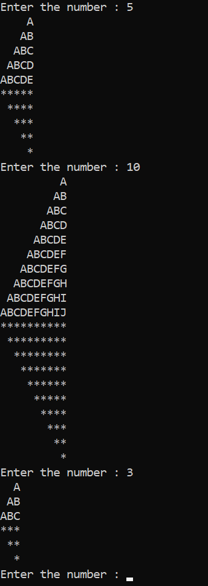

<!--left and inverted left half pyramid-->
Pattern
---

### left _half_ __Pyramid__

```c
#include<stdio.h>
int main()
{
    int num,row,col,space;
    printf("Enter the number: ");
    scanf("%d",&num);

    for(row=1; row<=num; row++)
    {
        for(space=1; space<=num-row; space++)
        {
            printf(" ");
        }
        for(col=1; col<=row; col++)
        {
            printf("%d",col);
        }
        printf("\n");
    }
    getch();
}
```
  

### inverted left half pyramid

```c
#include<stdio.h>
int main()
{
    int num,row,col,space;
    printf("Enter the number : ");
    scanf("%d",&num);

    for(row=num; row>=1; row--)
    {
        for(space=1; space<=num-row; space++)
        {
        printf(" ");
        }
        for(col=1; col<=row; col++)
        {
            printf("%d",row);
        }
        printf("\n");
    }
    getch();
}
```


## Both left half & inverted half pyramid

```c
#include<stdio.h>
int main()
{
    while(1)
    {
    int num,row,ro,col,co,space,sp;
    printf("Enter the number : ");
    scanf("%d",&num);

    for(row=1; row<=num; row++)
    {
        for(space=1; space<=num-row; space++)
        {
        printf(" ");
        }
        for(col=1; col<=row; col++)
        {
            printf("%c",col+64);
        }
        printf("\n");
    }
    
    for(ro=num; ro>=1; ro--)
    {
        for(sp=1; sp<=num-ro; sp++)
        {
            printf(" ");
        }
        for(co=1; co<=ro; co++)
        {
        printf("*");
        }
        printf("\n");
    }
    }
    getchar();
}
```  



Go to the next math.
</br>
I have sent you a request to end the programme.  

Good bye.
